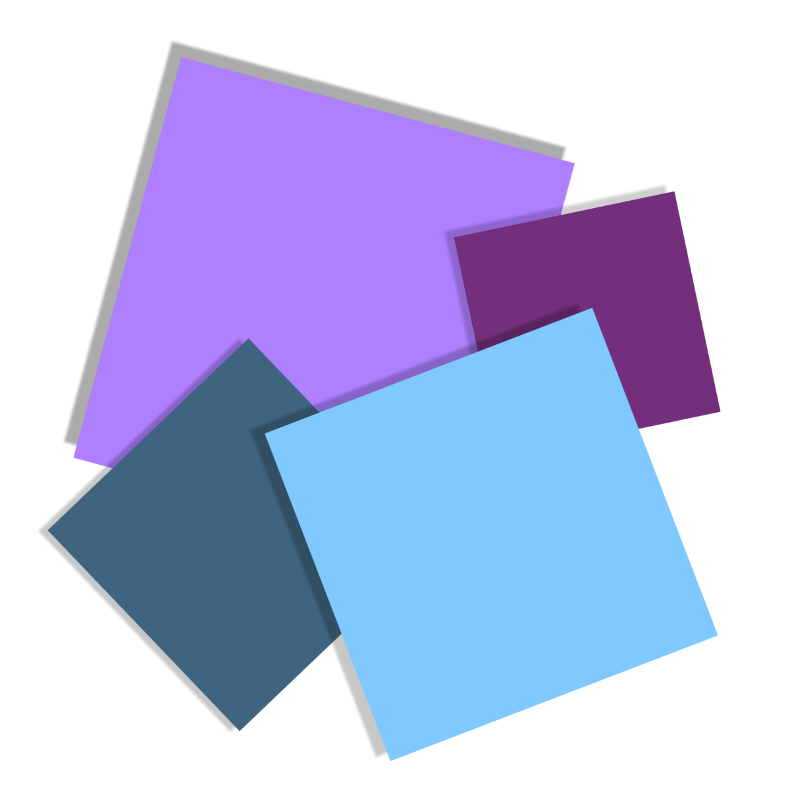

<p align="center"></p>

<h1 align="center">Qubik Launcher</h1>

<em><h5 align="center">Our fork from the [HeliosLauncher][mainrepo]</h5></em>
<h5 align="center">[](https://github.com/Qubik-Studios/Qubik-Launcher/actions/workflows/node.js.yml)</h5>


<p align="center">Play the Qubik Client the Right way with the use of our Own Client!</p>


## Features

* 🔒 Full account management.
  * Add multiple accounts and easily switch between them.
  * Credentials are never stored and transmitted directly to Mojang.
* 📂 Efficient asset management.
  * Receive client updates as soon as we release them.
  * Files are validated before launch. Corrupt or incorrect files will be redownloaded.
* ☕ **Automatic Java validation.**
  * If you have an incompatible version of Java installed, we'll install the right one *for you*.
  * You do not need to have Java installed to run the launcher.
* 📰 News feed natively built into the launcher.
* **Our Own Client**
  * The Launcher supports our Own Client with diffrent Version Channel.

This is not an exhaustive list. Download and install the launcher to gauge all it can do!


#### Like the project? Leave a ⭐ star on the repository!

## Downloads

**Currently under hard Development**

You can download from [GitHub Releases](https://github.com/Qubik-Studios/Qubik-Launcher/releases)

**Supported Platforms and current state of Developement**

If you download from the [Releases](https://github.com/Qubik-Studios/Qubik-Launcher/releases) tab, select the installer for your system.

| Platform | File | Ready? | 
| -------- | ---- | ------ |
| Windows x64 | `Qubik-Launcher-setup-VERSION.exe` | Yes ✔
| macOS | `Qubik-Launcher-setup-VERSION.dmg` | No ❌
| Linux x64 | `Qubik-Launcher-setup-VERSION.AppImage` | No ❌

**State of Testing**

See the current Progress of the Launcher test phases.

| Phase | Progress | Finish | Active |
| -------- | ---- | ------ | ------ |
| -Alpha- | ---- | ------ | ------ |
| Team Alpha | 100% | Yes ✔ | Yes ✔
| Closed Alpha | 100% | Yes ✔ | Yes ✔ |
| Open Alpha | 0% | No ❌ | No ❌ |
| -Beta- | ---- | ------ | ------ |
| Team Beta | 0% | No ❌ | Yes ✔ |
| Closed Beta | 0% | No ❌ | No ❌ |
| Open Beta | 0% | No ❌ | No ❌ |


## Console

To open the console, use the following keybind.

```console
ctrl + shift + i
```

Ensure that you have the console tab selected. Do not paste anything into the console unless you are 100% sure of what it will do. Pasting the wrong thing can expose sensitive information.

#### Export Output to a File

If you want to export the console output, simply right click anywhere on the console and click **Save as..**


#### Debug Main Process

This allows you to debug Electron's [main process][mainprocess]. You can debug scripts in the [renderer process][rendererprocess] by opening the DevTools Window.

---

### Note on Third-Party Usage

You may use this software in your own project so long as the following conditions are met.

* Credit is expressly given to the original authors (Daniel Scalzi).
  * Include a link to the original source on the launcher's About page.
  * Credit the authors and provide a link to the original source in any publications or download pages.
  * Credit to Qubik Studios if you use this fork of HeliosLauncher
* The source code remain **public** as a fork of this repository.

We reserve the right to update these conditions at any time, please check back periodically.

---

## Resources

* [Docs][docs]
* [Nebula (Create Distribution.json)][nebula]

The best way to contact the developers is on Discord.

[][discord]

### Found a bug?
Join our Bug Report Discord!

[][bugTracker]
---

### See you ingame.


# A Project maintained by Qubik Studios

[nodejs]: https://nodejs.org/en/ 'Node.js'
[vscode]: https://code.visualstudio.com/ 'Visual Studio Code'
[mainprocess]: https://electronjs.org/docs/tutorial/application-architecture#main-and-renderer-processes 'Main Process'
[rendererprocess]: https://electronjs.org/docs/tutorial/application-architecture#main-and-renderer-processes 'Renderer Process'
[chromedebugger]: https://marketplace.visualstudio.com/items?itemName=msjsdiag.debugger-for-chrome 'Debugger for Chrome'
[discord]: http://discord.Qubik-Studios.net 'Discord'
[bugTracker]: http://discord.Qubik-Studios.net 'Bugtracker Discord'
[docs]: https://qubik-studios.net/index.php/docs-category/qubik-client/ 'Docs'
[nebula]: https://github.com/dscalzi/Nebula 'dscalzi/Nebula'
[mainrepo]: https://github.com/dscalzi/HeliosLauncher 'Original Source'